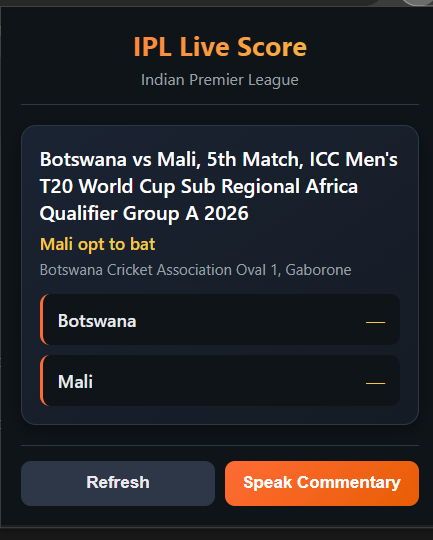

# 🏏 IPL Live Voice Commentary Extension

> An AI-powered Chrome extension that delivers live IPL score updates with real-time voice commentary.


---

# ✨ Overview

IPL Live Voice Commentary is a smart Chrome extension that brings live cricket commentary directly to your browser.

Instead of constantly checking score websites, users receive:
- 📡 Live IPL score updates
- 🎙 AI-style voice commentary
- ⚡ Real-time match information
- 🌙 Clean modern UI

The extension uses the browser's built-in SpeechSynthesis API to generate natural spoken commentary from live cricket data.

---

# 🎯 Problem Statement

Millions of cricket fans continuously switch tabs or apps to track live IPL scores during work or browsing sessions.

This extension solves that by:
- providing instant live updates
- enabling hands-free listening
- reducing distraction
- creating a radio-style live commentary experience

---

# 🚀 Features

## ✅ Current Features

- 🏏 Live cricket score fetching using CricAPI
- 🎙 Voice commentary using SpeechSynthesis API
- 🔄 Manual score refresh
- 🌙 Modern dark-themed UI
- 📢 Dynamic match status updates
- ⚡ Lightweight Chrome Extension
- 🧠 Smart commentary generation
- 🧩 Manifest V3 support

---

# 🧠 How It Works

```txt
Chrome Extension Popup
        ↓
Fetch Live Match Data
        ↓
Parse CricAPI JSON
        ↓
Generate Commentary Text
        ↓
SpeechSynthesis API
        ↓
Live Voice Commentary
```

---

# 🏗 Architecture

```txt
ipl-live-score-extension/
│
├── manifest.json        # Extension configuration
├── popup.html           # UI structure
├── styles.css           # Styling
├── popup.js             # Main logic
├── config.js            # API key (ignored from Git)
├── config.example.js    # Public API key template
├── .gitignore
└── README.md
```

---

# 🛠 Tech Stack

| Technology | Purpose |
|---|---|
| HTML | UI structure |
| CSS | Styling |
| JavaScript | Core logic |
| Chrome Extension API | Extension framework |
| CricAPI | Live cricket data |
| SpeechSynthesis API | Voice commentary |

---

# ⚡ Installation

## 1️⃣ Clone Repository

```bash
git clone https://github.com/khubi07/ipl-live-score-extension.git
```

---

## 2️⃣ Open Project

```bash
cd ipl-live-score-extension
```

---

## 3️⃣ Add API Key

Create:

```txt
config.js
```

Add:

```js
const CRICAPI_KEY = "YOUR_API_KEY";
```

Get free API key from:

https://www.cricapi.com/

---

## 4️⃣ Load Extension in Chrome

Open:

```txt
chrome://extensions
```

Then:
- Enable **Developer Mode**
- Click **Load unpacked**
- Select project folder

---

# 🎤 Voice Commentary Example

```txt
"Welcome to IPL Live Score.
Mumbai Indians are 178 for 4 in 20 overs.
Chennai Super Kings are 142 for 6 in 17 overs.
That is your IPL update."
```

---

# 🔥 Future Improvements

- 🤖 GPT-powered AI commentary
- 🔊 Auto commentary every over
- 🌐 Multi-language commentary
- 📱 Mobile/PWA version
- 📈 Match analytics
- 🔔 Background commentary mode
- 🏟 Team logos and animations
- 🎧 Voice customization

---

# 🧪 Challenges Faced

- Handling live cricket API responses
- Filtering IPL-specific matches
- Managing Chrome extension permissions
- Voice synchronization
- Real-time data updates

---

# 💡 Key Learnings

- Chrome Extension development
- Manifest V3 architecture
- Real-time API integration
- Speech synthesis systems
- Async JavaScript handling
- Frontend state management

---

# 📸 Screenshots

> Add screenshots here for better judging impact.


# 🌟 Why This Project Stands Out

Unlike traditional score trackers, this project introduces:
- voice-first interaction
- passive live match tracking
- real-time spoken commentary
- lightweight browser-native experience

It combines:
- sports tech
- browser extensions
- voice AI concepts
- real-time systems

into a single product experience.

---

# 👨‍💻 Author

## Khubi Sahu

Second Year B.Tech Computer Science Student  
Passionate about:
- AI-powered applications
- Backend systems
- Real-time products
- Browser tools

GitHub:
https://github.com/khubi07

---

# ⭐ Support

If you liked this project:
- ⭐ Star the repository
- 🍴 Fork it
- 🚀 Share feedback

---

# 📜 License

This project is built for educational and hackathon purposes.